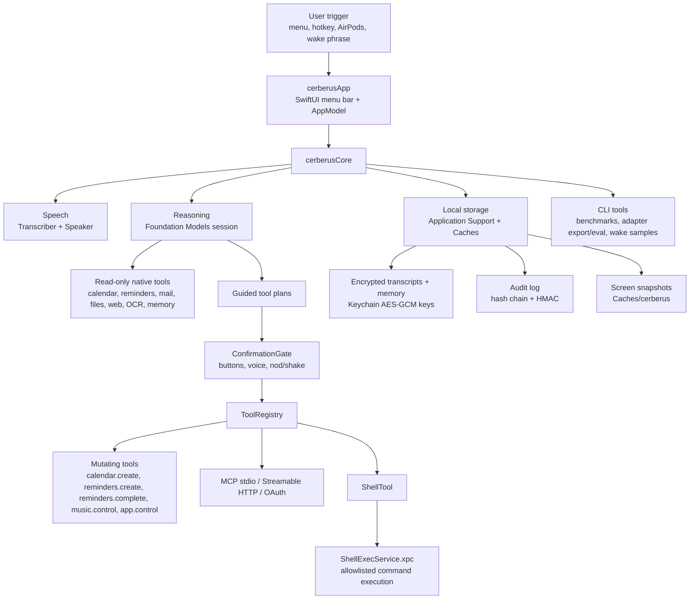

# Architecture

`cerberusApp` owns UI state, permissions, user settings, and confirmation presentation. `cerberusCore` owns deterministic state machines, tool implementations, security gates, storage, MCP clients, speech/model wrappers, and CLI support. The packaged app embeds `ShellExecService.xpc`; release scripts build/sign the nested service before signing the parent app.
