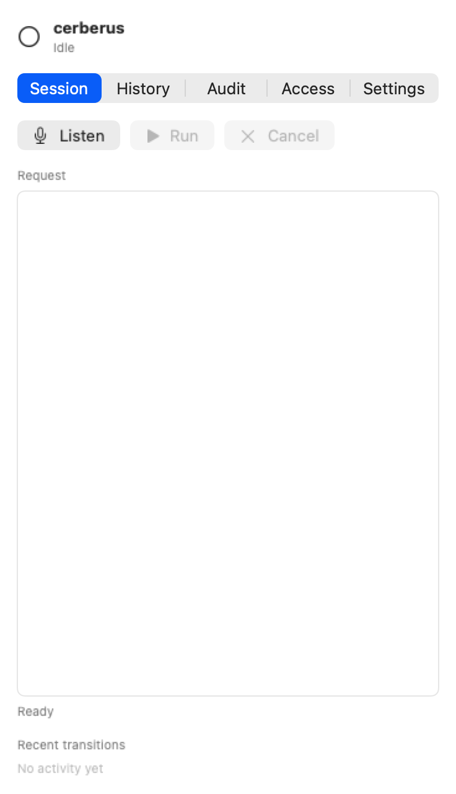
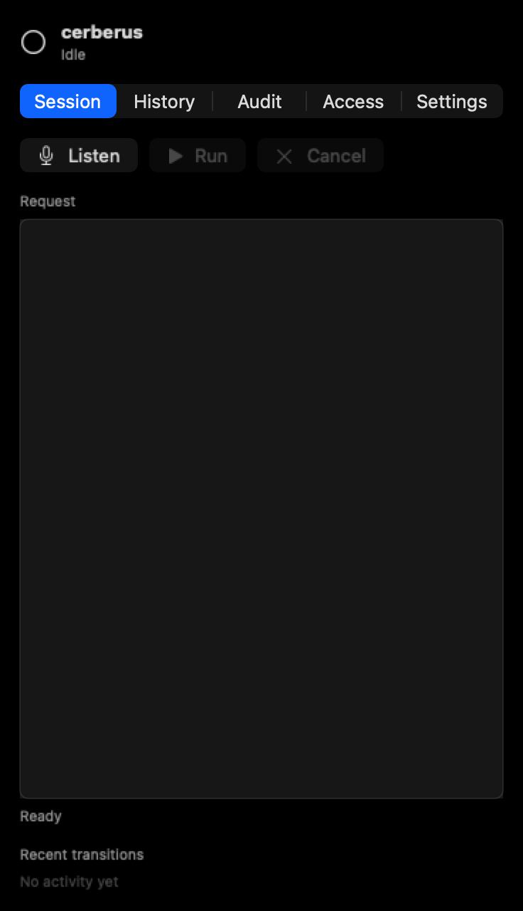

# cerberus

AirPods-driven, local-first screen-reading assistant for macOS.

The project is intentionally scoped as a native macOS utility:

- menu bar first, no main window by default
- first-run setup banner for required macOS permissions with per-permission progress persistence
- microphone activates only after an explicit trigger unless `Wake phrase` is enabled
- menu bar status icon tints red while the microphone is active
- SpeechAnalyzer for on-device speech-to-text
- live SpeechAnalyzer benchmark CLI for AirPods/noisy-room checks
- default-off wake phrase monitor with SpeechAnalyzer fallback or a configured SoundAnalysis/Core ML wake model
- wake-word WAV sample collector and CreateML trainer for local classifier training data
- speech replies can follow the current macOS output route or route directly to detected AirPods
- Foundation Models for on-device answering and native screen-reading tool calls
- Foundation Models latency benchmark CLI for screen-question checks
- optional `screen.describe` local VLM tool for passive screen VQA through MLX-VLM, Ollama, llama.cpp, or OpenAI-compatible localhost servers
- active macOS application context is included only as observer context
- optional AirPods gesture validation CSV logging for threshold tuning
- head gesture CSV evaluator for threshold tuning after real-device walks/tests
- per-session allowlist settings for screen-reading tools
- no app control, shell execution, browser navigation, MCP calls, EventKit writes, Mail Automation, Finder reveal, or Shortcuts execution in the shipped app surface
- encrypted local transcripts
- local screen snapshots plus text OCR, barcode/QR detection, and Accessibility UI geometry for screen questions
- optional prebuilt FoundationModels adapter loading plus transcript JSONL export/eval and Apple toolkit orchestration

## Requirements

- macOS Tahoe 26 or later
- Xcode 26 or later
- Apple Silicon Mac with Apple Intelligence enabled
- AirPods with headphone motion support for nod/shake triggers
- Microphone, Speech Recognition, Accessibility, Input Monitoring, and Screen Recording permissions as features are enabled

This repository uses Swift Package Manager for source organization. `Scripts/build_app.sh` assembles `.dist/cerberus.app` and applies `Config/cerberus.entitlements`.
`Scripts/release_check.sh` verifies Developer ID signing, notarization, demo-video, and open-source release gates.

## Screenshots

## Privacy

Planning, speech transcription, OCR, transcripts, wake samples, adapter config, and screen snapshots are local by default. Transcript records are encrypted with Keychain-backed AES-GCM keys; audit entries are hash-chained and HMAC-signed.

The shipped app surface only observes the current screen through ScreenCaptureKit, Vision OCR/barcodes, Accessibility element reads, and an optional local VLM endpoint when configured. It does not operate apps, run shell commands, navigate browsers, call MCP tools, search files, or contact network services by default.

## Permissions

- Accessibility: opens the Access panel and supports visible UI element geometry workflows.
- Input Monitoring: supports global trigger keys and media-key handling.
- Microphone: records voice requests, wake phrase monitoring, and speech benchmarks.
- Speech Recognition: runs SpeechAnalyzer/SpeechTranscriber transcription.
- Screen Recording: captures local screen snapshots, OCR text boxes, and barcode/QR results.

## Development Notes

Primary validation is `swift test` on macOS with Xcode 26.
Run `Scripts/lint_scripts.sh` before editing release or validation shell scripts.
Run `Scripts/static_grep_check.sh` before publishing or uploading logs.

See `Docs/macos-validation.md` for the current validation checklist.
See `Docs/adapters.md` for optional FoundationModels adapter loading.
See `Docs/model-benchmark.md` for Foundation Models planning/tool-loop latency checks.
See `Docs/local-vision-models.md` for optional local VLM candidates.
See `Docs/speech-benchmark.md` for live SpeechAnalyzer benchmark runs.
See `Docs/request-examples.md` for read-only, confirmation-gated, and refused request examples.
See `Docs/airpods.md` for AirPods motion troubleshooting.
See `Docs/troubleshooting.md` for Foundation Models, SpeechAnalyzer, permissions, and screen capture recovery.
See `Docs/wake-word.md` for optional SoundAnalysis/Core ML wake model setup.
See `Docs/distribution.md` for local app packaging, demo recording, and notarization.
See `Docs/architecture.md` for the current app/core/tool/service layout.
See `Docs/security-model.md` for trust boundaries, execution rules, and reviewer checks.
See `Docs/threat-model.md` for prompt-injection, tool-misuse, and local-storage threat notes.
See `Docs/open-source.md` for public repository release checks.
See `CONTRIBUTING.md` for local setup, validation, signing, and hardware prerequisites.
